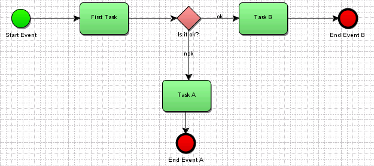
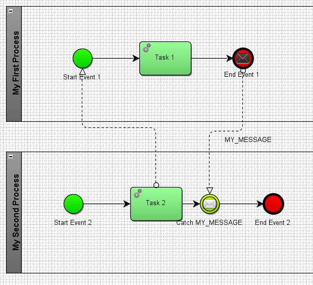

bpmn.js
================

Introduction
------------
BPMN execution is deemed to be a good way to describe process oriented business logic. This is especially true if we have to describe the orchestration and collaboration of service- and UI-interactions. Many of these interactions are asynchronous and event driven making node an ideal candidate for implementing a BPMN engine.

To draw the BPMN file each BPMN 2.0 compliant tool can be used. If you want to have support by creating the handler files we recommend the node package (TODO).

Installation
------------
The easiest way to install it is via NPM:

    npm install bpmn.js

Assumptions
-----------

- This package assumes each BPMN 2.0 file is accompanied by an equal named JS file. For example, the directory containing `myprocess.bpmn` must contain also `myprocess.js` holding the BPMN event handlers. If this is not the case, an error is thrown while creating the process.
- Each BPMN element name is unique per process. This simplifies live considerably because we can use names instead of IDs simplifying the world for users and developers alike. If this is not the case, an error is thrown while creating the process.
- The user must ensure that the process instance ID is unique.

Basic Example
=============

These following samples assume that you installed bpmn.js via NPM.

Assume myProcess.bpmn describes the following process

then this process can be created by

   
	var bpmn = require("bpmn.js");
	// We assume there is a myProcess.js besides myProcess.bpmn that contains the handlers
	// Furthermore, the user must ensure that the process ID is unique
	var myProcess = bpmn.createProcess("myid", "path/to/myProcess.bpmn");

    // we start the process
    myProcess.triggerEvent("MyStart");

The handler file looks like:

	exports.MyStart = function(data, done) {
    	// called after the start event arrived at MyStart
    	done(data);
	};

	exports.MyTask = function(data, done) {
    	// called at the beginning of MyTask
    	done(data);
	};

	exports.MyTaskDone = function(data, done) {
    	// Called after the process has been notified that the task has been finished
		// by invoking myProcess.taskDone("MyTask").
		// Note: <task name> + "Done" handler are only called for 
		// user tasks, manual task, and unspecified tasks
    	done(data);
	};

	exports.MyEnd = function(data, done) {
    	// Called after MyEnd has been reached
    	done(data);
	};

If no handler is defined, the default handler is being called. This handler can also be specified in the handler file by:

	/**
 	 * @param {String} eventType Possible types are: "activityFinishedEvent", "callHandler"
 	 * @param {String?} currentFlowObjectName The current activity or event
 	 * @param {String} handlerName
 	 * @param {String} reason Possible reasons:
	 * 							- no handler given
	 *							- process is not in a state to handle the incoming event
	 *							- the event is not defined in the process
	 *							- the current state cannot be left because there are no outgoing flows
 	 */	
	exports.defaultEventHandler = function(eventType, currentFlowObjectName, handlerName, reason, done) {
		// Called, if no handler could be invoked. 
    	done(data);
	};

If the default handler is not specified the default default event handler is being called which just logs a message to stdout.

Besides the default event handler, it is also possible to specify a default error handler:
	
	exports.defaultErrorHandler = function(error, done) {
    	// Called if errors are thrown in the event handlers
    	done();
	};

Handler Context (this)
----------------------

Each handler is called in the context of the current process. More formally: `this` is bound to `BPMNProcessClient`. This object offers the following interface to the current process instance:

- `taskDone(taskName, data)`: notify the process that a task has been done. This triggers calling the event handler: `taskName` + "Done"
- `triggerEvent(eventName, data)`: send an event to the process
- `getState()`: get the state of the current process. The state object is `BPMNProcessState`.
- `getHistory()`: get the history of the current process. Basically a list of all visited activities and events encapsulated in `BPMNProcessHistory`
- `setProperty(name, value)`: set a process property. This property is also persisted together with the process. The value is a valid JS data object. That is, we do not persist functions.
- `getProperty(name)`: get property.
- `getParentProcess()`: if this process has been called by a `callActivity` activity, this call returns a `BPMNProcessClient` instance of the calling process. Otherwise it returns `null`.
- `getParticipantByName(participantName)`: if this process collaborates with other processes (see section *Collaboration Processes*), this call returns a `BPMNProcessClient` instance of a participating process instance having the name `participantName`. This allows to send for example an event to a participating process by
	this.getParticipantName("Another process").triggerEvent("my event");

Handler Names
-------------
The handler names are derived by replacing all not allowed JS characters by '_'. For example, "My decision?" becomes `My_decision_`. The bpmn module exports `mapName2HandlerName(bpmnName)` that can be invoked to get the handler name for a given BPMN name.

Exclusive Gateways (Decisions)
==============================

If the following process has to be implemented, we have to provide three handlers for the exclusive gateway:
	
	exports.Is_it_ok_ = function(data, done) {
    	// called after arriving at "Is it ok?"
    	done(data);
	};

	exports.Is_it_ok_$ok = function(data, done) {
    	// has to return true or false
		// the name of the sequence flow follows after "$".
		// if there is no name, an error is thrown 
    	done(data);
	};

	exports.Is_it_ok_$nok = function(data, done) {
    	// has to return true or false
		// the name of the sequence flow follows after "$".
		// if there is no name, an error is thrown 
    	done(data);
	};

**Note**: 
For each outgoing transition we have a condition handler that hast to evaluate synchronously. So if backend data are required, fetch them in the gateway callback.
Furthermore, BPMN does not specify the order of evaluating the flow conditions, so the implementer has to make sure, that only one operation returns `true`. Additionally, we ignore the condition expression. We consider this as part of the implementation.

Timeouts
========

To implement timeouts use two handlers:

	exports.MyTimeout$getTimeout = function(data, done) {
    	// called when arriving on "MyTask"
		// should return timeout in ms.
    	done(data);
	};

	exports.MyTimeout = function(data, done) {
    	// called if the timeout triggers
    	done(data);
	};

Collaborations
==============

BPMN also supports collaborating processes as depicted below.

These processes must be created together:

	// define a list of process descriptors holding process name and id
	var processDescriptors = [
        {name: "My First Process", id: "myFirstProcessId_1"},
        {name: "My Second Process", id: "mySecondProcessId_1"}
    ];

	// create collaborating processe
    var collaboratingProcesses = publicModule.createCollaboratingProcesses(processDescriptors, "my/collaboration/example.bpmn");

    // start the second process
    var secondProcess = collaboratingProcesses[1];
    secondProcess.triggerEvent("Start Event 2");

The collaboration of the processes is then implemented in the handlers. For example, it is possible to get a partner process by name and then send an event to this process. This is frequently done to start the partner process:

	exports.Task_2 = function(data, done) {
    	// after arriving ot "Task 2" we start process 1
    	var partnerProcess = this.getParticipantByName("My First Process");
    	partnerProcess.triggerEvent("Start Event 1");
    	done(data);
	};

However, another option is to get all outgoing message flows and send a message along these flows. In the current example we have exactly one flow, so sending the message is done by:

	exports.End_Event_1 = function(data, done) {
    	// after reaching the end of process 1, we send a message
    	var messageFlows = this.getOutgoingMessageFlows("End Event 1");
    	this.sendMessage(messageFlows[0], {gugus: "blah"});
    	done(data);
	};

**Note**: all task and event names must be unique

Supported BPMN Elements
-----------------------
- Start events: all kind of start events are mapped to the none start event. Any further specialization is then done in the implementation of the handler.
- End events: all kind of end events are mapped to the none end event. Any further specialization is then done in the implementation of the handler.
- Gateways: Parallel- and exclusive gateways are supported.
- Task, User Task, Manual Task, Receive Task: These tasks call an event handler when the task starts and then wait until `taskDone(taskName, data)` is invoked on the process.
- Service Task, Script Task, Business Rule Task, Send Task (Wait Tasks): These tasks call an event handler when the task starts and proceed immediately after the the handler finishes.
- Throw Intermediate Events: the handler is triggered when the intermediate event is reached. All types of intermediate events are treated the same.
- Catch Intermediate Events: the handler is triggered if the event is sent to process 
- Call Activity: an external sub-process is called. The sub-process must not be a collaboration and must have exactly one start event.
- Boundary Events: message and timeout boundary elements are supported for all wait tasks (Task, User Task, Manual Task, Receive Task).

Limitations 
-----------
- Start events: all kind of start events are mapped to the none start event. Any further specialization is then done in the implementation of the handler.
- End events: all kind of end events are mapped to the none end event. Any further specialization is then done in the implementation of the handler.
- Gateways: only parallel- and exclusive gateways are supported yet.
- Data objects: are ignored by the engine

Future enhancements
-------------------

- **Persistency**:
 The engine will save the state while waiting for a task being done. While this is happening, all events are deferred until the state has been saved. When creating a process the engine will reload existing processes having the given ID. If there is no such process, it will be created. The process can be persisted to the file system or to a MongoDB. We recommend the latter approach for productive use cases. 

Licensing
---------

http://creativecommons.org/licenses/by-nc-sa/3.0/

Questions, comments, thoughts?
------------------------------
This is a very rough work in progress. 

Feel free to contact me at mrassinger@e2e.ch with questions or comments about this project.

